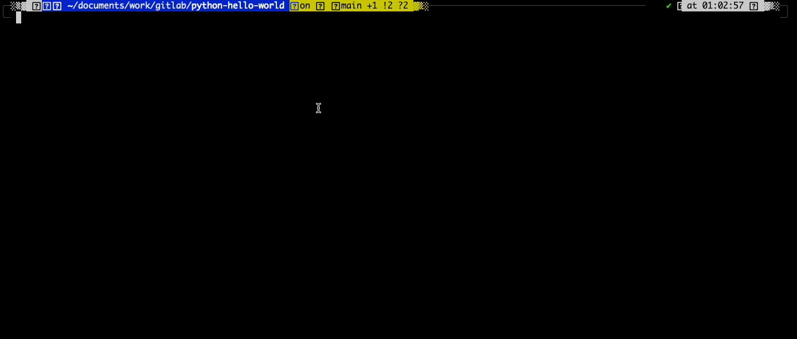
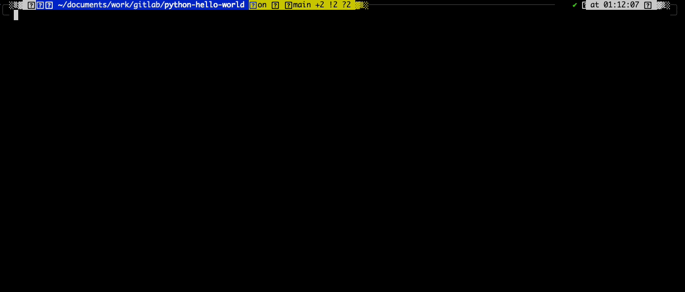
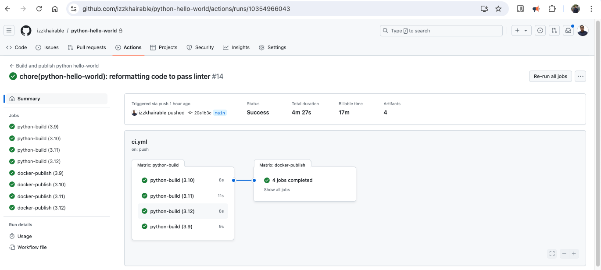
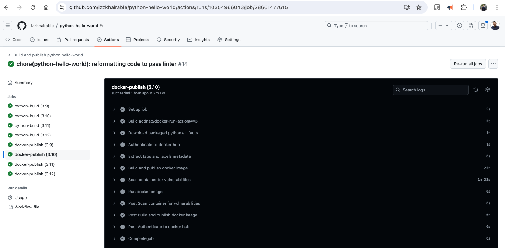

# Python `Hello world` Program


## Getting Started

### Running in Local Machine



#### Install Requirements

```shell
pip install -r requirements.txt
```

#### Running the `Hello world` program

```shell
python src/main.py
```

#### Running Test Cases

```shell
coverage run -m unittest discover -p '*_test.py'
coverage report -m --omit="*_test.py"
```

### Running in Docker 



#### View the published Docker Images on Docker Hub: [izzkhair/python-hello-world](https://hub.docker.com/repository/docker/izzkhair/python-hello-world/general)

To ensure that the `Hello world` program is `backward compatible`, each new increment of the 
`Hello world` python program would result in the publishing of 4 docker images for the 
follow python versions:

> Python version of `Hello world` images available: **3.12, 3.11, 3.10, 3.9**

#### Pull the published images from Docker Hub

```shell
docker pull izzkhair/python-hello-world:main-3.12
docker pull izzkhair/python-hello-world:main-3.11
docker pull izzkhair/python-hello-world:main-3.10
docker pull izzkhair/python-hello-world:main-3.9
```

#### Run container using pulled images in Local Machine

```shell
docker pull izzkhair/python-hello-world:main-3.12
PYTHON_VERSION=3.12
docker run izzkhair/python-hello-world:main-$PYTHON_VERSION
```

#### Optional: Build image and Run container in Local Machine
```shell
docker build --no-cache --build-arg BASE_IMAGE_VERSION=3.12 -t python-hello-world-local .
docker run python-hello-world-local
```

## GitHub Actions






#### View the GitHub Action Workflows and Jobs: [izzkhairable/python-hello-world/actions](https://github.com/izzkhairable/python-hello-world/actions)

Currently, the GitHub Actions for this project is configured with a workflow `Build and publish python hello-world` and it
contains two jobs: 

- `python-build`: test, lint, build artifacts, run `hello world` program and upload the artifacts
- `docker-publish`: builds and publish `hello world` image to docker hub, scans for vulnerability and run the image

```yaml
name: Build and publish python hello-world
jobs:
  python-build:
    steps:
      - Checkout to current branch
      - Set up Python X.YZ
      - Display Python version
      - Install dependencies
      - Lint with Ruff
      - Test with Unittest
      - Run python program
      - Upload packaged python artifacts
  docker-publish:
    steps:
      - Download packaged python artifacts
      - Authenticate to docker hub
      - Extract tags and labels metadata
      - Build and publish docker image
      - Scan container for vulnerabilities
      - Run docker image
```

## Dependencies

### Python Packages

```yaml
inspirational-quotes
pyfiglet
wonderwords
ruff
```

### GitHub Actions

```yaml
actions/checkout
actions/setup-python
actions/upload-artifact
actions/download-artifact
docker/login-action
docker/metadata-action
docker/build-push-action
crazy-max/ghaction-container-scan
addnab/docker-run-action
```

## Contributing

If you'd like to contribute, please fork the repository, create a PR or open an issue.

## Useful Links

* https://github.com/izzkhairable/python-hello-world/actions
* https://hub.docker.com/repository/docker/izzkhair/python-hello-world/general

